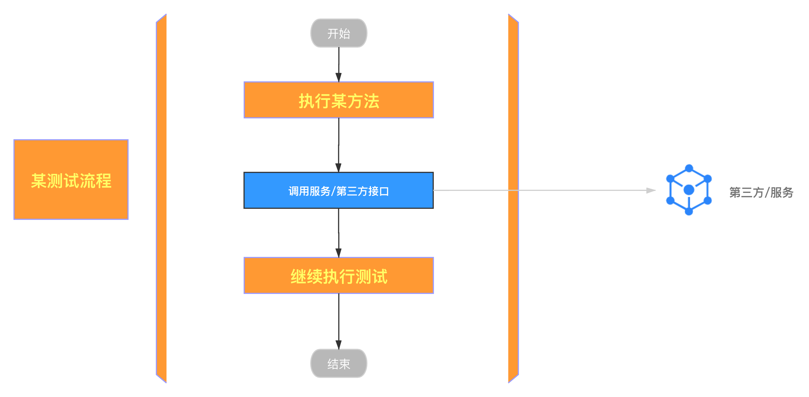
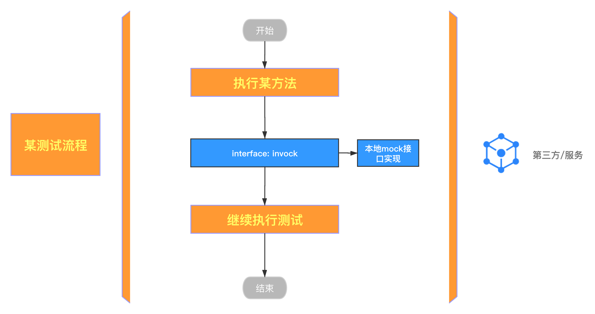

#Mock Utility

##项目概要
在项目开发中，测试环节是一个很重要的过程，对于开发人员来讲，编写单元测试，在本地进行调试是很常见的，但是现在的服务，往往会依赖其他服务接口，
在调试过程需要确保依赖的服务正常运行，这时候调试过程才能顺利进行，否则会报错。
如何能够在第三方服务无需启动的情况下，就能确保调试进行下去，保证主要流程按照期望进行下去，而又无需去修改代码呢？

一般调试过程如下，在调试/测试中需要调用第三方/服务，如果第三方服务并不稳定（我们并不想在测试中确保第三方服务一定要正常运行）。

<div align="center">  </div>


此项目通过将调用的接口注入本地mock接口，以保证在测试过程无需依赖第三方服务。

<div align="center">  </div>


## 使用方法
使用示例见 [mock-example](mock-example)
```java
//this is test interface
public interface TestService {

    void test();
}


// this is remote service implementation, for case , using @realService

@RealService("testService")
public class RealTestServiceImpl implements TestService {

    @Override
    public void test() {
        System.out.println("i am real service");
    }
}

@MockService("testService")
public class MockTestServiceImpl implements TestService {
    @Override
    public void test() {
        System.out.println("i am mock service");
    }
}


public class TestCase{

    @Autowired
    TestService testService;

    @Tests
    public void test() throws Exception {
        testService.test();
    }
}


// at properties using 
mock.service.enabled=true
mock.service.testService.enabled=true
// 如果期望TestService 使用原service，可以设置mock.service.enabled=false来关闭mock service, 或者mock.service.testService.enabled=false 只关闭该远程调用结果.

```


RoadMap
详情见→ 

